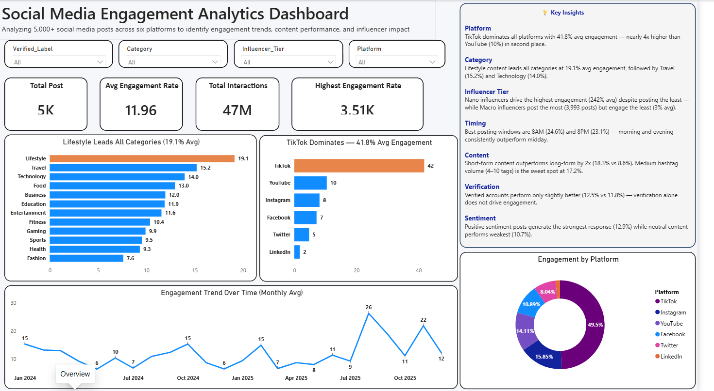
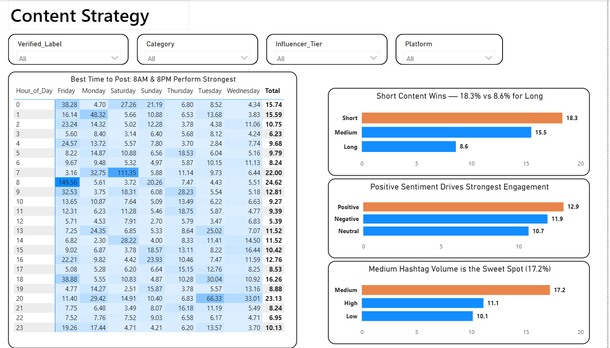
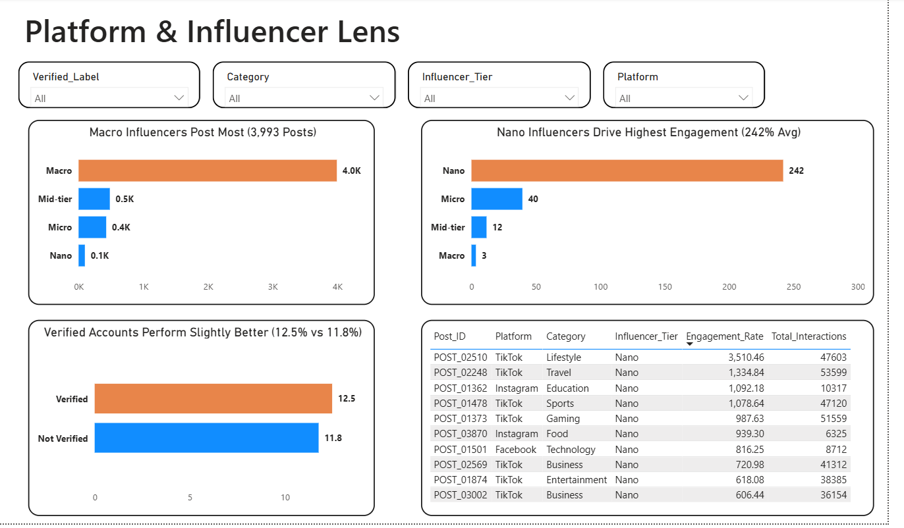

# Social Media Engagement Analysis

Analyzing 5,000 social media posts across six platforms to uncover what drives audience engagement — content category, platform, posting time, hashtag volume, and content length — and translating that into content strategy recommendations.

## Project Overview

This project simulates a real brand/marketing analytics workflow: cleaning raw engagement data, running SQL analysis to surface patterns, and building an interactive dashboard to communicate findings to a non-technical stakeholder. It reflects the kind of analysis I currently do professionally in Online Reputation Management (ORM) — tracking engagement, sentiment, and content performance for brand teams — applied here to a public dataset as a self-directed data analytics project.

## Dataset

**Source:** [Social Media Engagement Dataset](https://www.kaggle.com/) (Kaggle)
**Size:** 5,000 posts, 20 columns
**Platforms:** Instagram, Facebook, TikTok, Twitter, YouTube, LinkedIn
**Key fields:** Likes, Comments, Shares, Views, Saves, Follower_Count, Engagement_Rate, Hour_of_Day, Day_of_Week, Hashtag_Count, Content_Length, Sentiment, Influencer_Tier, Is_Verified, Has_Media

## Pipeline

```
Python (Jupyter Notebook)  →  MySQL  →  Power BI
     data cleaning              SQL analysis      dashboard
```

**1. Python (Jupyter Notebook)**
- Loaded and inspected the raw CSV (`.head()`, `.tail()`, `.info()`)
- Checked for null values (`.isnull().sum()`) — dataset had zero missing values
- Removed duplicate rows
- Fixed data types (Timestamp converted to proper datetime)
- Exported a cleaned CSV for MySQL import

**2. MySQL**
- Designed and created the `posts` table schema
- Loaded the cleaned CSV via `LOAD DATA LOCAL INFILE`
- Added two engineered columns directly in SQL: `Total_Interactions` (sum of Likes + Comments + Shares + Saves) and `Hashtag_Bucket` (Low/Medium/High, via `CASE WHEN`)
- Ran the full analysis query set (see `/sql/analysis_queries.sql`)

**3. Power BI**
- Connected directly to the MySQL database
- Built a multi-page interactive dashboard (see Dashboard section below)

## SQL Techniques Used

- **Aggregation:** `GROUP BY` across Category, Platform, Influencer_Tier, Sentiment
- **Conditional bucketing:** `CASE WHEN` for Hashtag_Bucket and Content_Length buckets
- **Window functions:** `RANK() OVER (PARTITION BY ... ORDER BY ...)` to rank posts within categories/platforms; `AVG() OVER (PARTITION BY ...)` to compare each post against its group average without collapsing rows
- **CTEs (`WITH ... AS`):** used to filter on window function results (e.g. top 3 posts per platform) and to structure multi-step logic (best posting hours, content length buckets)
- **Cross-dimensional analysis:** combined `Day_of_Week` and `Platform` in a single query to check whether platform performance varies by day

Full query file: [`/sql/analysis_queries.sql`](./sql/analysis_queries.sql)

## Key Findings

**Category & Platform**
- **Lifestyle** is the highest-performing content category (19.13% avg engagement), followed by Travel (15.21%) and Technology (13.96%).
- **TikTok** is the best-performing platform overall (41.83% avg engagement), far ahead of every other platform.
- **TikTok dominates every single day of the week**, outperforming the next-best platform by roughly 5–7x. Friday is TikTok's strongest day (~86.6% avg engagement vs. 20–52% on other days).
- **LinkedIn consistently underperforms**, showing the lowest average engagement rate across all seven days of the week.

**Influencer Tier**
- **Macro influencers** are the most active tier by volume (3,993 posts).
- **Nano influencers** drive the most engagement per post (10,151 avg interactions) — despite posting less, they engage far more per post than any other tier.

**Verification & Sentiment**
- Verified accounts perform only slightly better than non-verified (12.49% vs. 11.77%) — verification is **not** a primary driver of engagement.
- **Positive sentiment** generates the strongest response (12.90% avg engagement); neutral content performs the weakest.

**Hashtags & Content Length**
- **Medium hashtag usage** is the clear sweet spot, delivering the highest engagement (17.20%) — both under- and over-hashtagging underperform.
- **Short-form content** generates the highest engagement (18.34%), followed by medium (15.49%) and long-form (8.60%) — engagement drops steadily as content length increases.

**Timing**
- Best posting times: **8:00 AM (24.62%)**, **8:00 PM (23.13%)**, and **7:00 AM (21.99%)** — engagement peaks in the morning (7–8 AM) and evening (8 PM) windows.

**Outliers**
- A small number of **Nano-tier posts with very low follower counts (under ~5,000) produced extreme engagement rates (300%–3,500%+)** — since Engagement_Rate is calculated relative to follower count, a modest viral moment for a small account inflates this metric dramatically. Worth noting as a caveat when interpreting average engagement rate for smaller accounts.

**Post-Level Analysis**
- Ranking posts within each category (window functions) surfaces a small number of standout posts driving most of the category's performance, rather than even distribution.
- Comparing each post to its category average cleanly separates over- and under-performers, useful for benchmarking future campaigns.
- Top-3-per-platform rankings provide concrete platform-specific content benchmarks.

## Strategic Takeaways

- **Prioritize Lifestyle-focused content on TikTok** — the strongest category/platform combination in the dataset.
- **Leverage Nano and Micro influencers to maximize engagement**, while using Macro influencers to extend reach — different tiers serve different strategic goals (engagement depth vs. audience breadth).
- **Content strategy (tone + hashtag volume) matters more than account verification.** Verification alone is not worth over-indexing on.
- **Combine short-form content with peak morning (7–8 AM) and evening (8 PM) posting windows** to maximize reach and interaction — the single most actionable, low-effort recommendation from this analysis.

## Dashboard

Built in Power BI with 3 interactive pages, connected directly to MySQL. All pages include slicers for Platform, Category, Influencer Tier, and Verified status.

**Page 1 — Overview**



**Page 2 — Content Strategy**



**Page 3 — Platform & Influencer Lens**



## Repo Structure

```
├── README.md
├── data_cleaning.ipynb            # Python cleaning steps (Jupyter Notebook)
├── Analysis Queries.sql           # Full SQL analysis (schema + all queries)
├── dashboard/
│   └── screenshots/
│       ├── page1_overview.png
│       ├── page2_content_strategy.png
│       └── page3_platform_influencer.png
└── About Data.txt                 # Dataset description
```

## Tools Used

Python (pandas) · MySQL · Power BI

## Author

Asif — transitioning from Online Reputation Management to Data Analytics.

[LinkedIn](https://www.linkedin.com/in/theasifalikhan/) · [GitHub](https://github.com/Asif-ali-khan)
